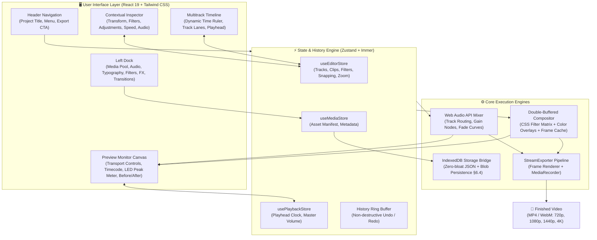

# ⚡ Apex Editor — Professional Creative Video Suite

<div align="center">


**A modern, high-performance Non-Linear Video Editor (NLE) engineered for seamless browser-based editing with desktop-grade responsiveness.**

[Features](#-key-features) • [Architecture](#-system-architecture) • [Workspace Layout](#-workspace-layout) • [Getting Started](#-getting-started) • [Shortcuts](#-keyboard-shortcuts)

</div>

---

## 📐 System Architecture

The following diagram illustrates how **Apex Editor** decouples state management, high-frequency canvas compositing, multitrack audio mixing, and binary asset persistence:



---

## 🎛️ Workspace Layout

Apex Editor organizes complex NLE capabilities into an intuitive 4-quadrant layout:

```
┌─────────────────────────────────────────────────────────────────────────────────────────────────┐
│ ⚡ APEX EDITOR   [File] [Edit] [Help]       Untitled Project (1920x1080 @ 30fps)    [Export Video]│
├───────────────┬───────────────────────────────────────────────┬─────────────────────────────────┤
│  LEFT DOCK    │               PREVIEW MONITOR                 │       INSPECTOR PANEL           │
│ ───────────── │ ───────────────────────────────────────────── │ ─────────────────────────────── │
│ 📁 Media      │                                               │ 📐 Transform                    │
│ 🎵 Audio      │               [ Video Canvas ]                │    • Position X / Y             │
│ 🔤 Text       │              (Aspect: 16:9, 9:16)             │    • Scale (10% - 300%)         │
│ 🎚️ Filters    │                                               │    • Rotation (-180° to 180°)   │
│ ✨ FX         │  [Before/After Badge Overlay]                 │    • Opacity (0% - 100%)        │
│ 🔀 Transition │  00:01:24:12 / 00:05:00:00                    │ 🎚️ Active Filter & Intensity     │
│               │  [⏮] [◀] [ ▶ ] [▶] [⏭]   🔊 ──●── [LED Meter] │ 🎨 Color Adjustments            │
│  [Filter Grid]│                                               │ ⚡ Playback Speed (0.25x - 8x)  │
│  [Intensity %]│                                               │ 🔊 Audio & Fade In/Out Curves   │
├───────────────┴───────────────────────────────────────────────┴─────────────────────────────────┤
│  TIMELINE TOOLBAR: [Pointer] [Razor] | [✂ Split] [🗑 Delete] | [🧲 Snap] [☰ Ripple] | [- Zoom +]│
├───────────────┬─────────────────────────────────────────────────────────────────────────────────┤
│ Track: Text 1 │  [ 🔤 Title Clip (4.0s) ]                                                       │
│ Track: Video 2│                    [ 🎞️ Overlay Video (3.5s) ]                                  │
│ Track: Video 1│  [ 🎬 Main Footage (12.0s) ═══════════════════════════════════════════════ ]   │
│ Track: Audio 1│  [ 🎵 Sound Effect (2.0s) ]                                                     │
│ Track: Audio 2│  [ 🎼 Background Music (15.0s) ~~~ Waveform Peaks ~~~~~~~~~~~~~~~~~~~~~~~~ ]    │
│               │                          ▲ (Playhead Red Needle)                                │
└───────────────┴─────────────────────────────────────────────────────────────────────────────────┘
```

---

## 🚀 Key Features

### 1. Non-Destructive Multitrack Timeline
- **Infinite Track Scalability**: Video overlay tracks, dedicated audio layers, and typography tracks.
- **Precision Trimming**: Drag left/right edge handles to non-destructively adjust in-points and durations.
- **Razor Cut (`S` / `Ctrl+B`)**: Frame-accurate split at the playhead position without altering raw source media.
- **Magnetic Snapping**: Automatically snaps clips to neighboring boundaries and the playhead.
- **Dynamic Zoom**: Scalable time ruler from frame-level examination to macro project overview.

### 2. Zero-Flicker Double-Buffered Compositor
- **Double-Buffering**: Renders all layers, transforms, and filters onto an offscreen canvas buffer before copying to the visible canvas in one atomic operation.
- **Persistent Frame Cache**: Video assets maintain the last-known decoded frame during seeks, completely eliminating black-frame blinking.
- **Real-Time Matrix Transforms**: GPU-accelerated translate, scale, rotation, and opacity calculations.
- **Visual Filters & Cinematic Presets**: Live brightness, contrast, saturation, blur, vignette, and film look grades.
- **Transitions**: Fade to Black, Cross Dissolve, Slide Left, and Slide Right.

### 3. Professional Video Filters System (Canva & CapCut Quality)
- **36 Curated Creative Filters**: Organized across 6 distinct categories: Basic, Cinematic, Vintage, Black & White, Mood, and Color.
- **Dynamic Intensity Engine (0% - 100%)**: Smooth linear interpolation scaling from raw unedited video at 0% up to full stylized grade at 100%.
- **Live Before/After Comparison**: Press-and-hold "Before" button to bypass filters in real time with animated live badge feedback.
- **Color Overlays & Blend Modes**: Sophisticated Canvas 2D color grading using `soft-light` compositing and radial vignettes.
- **Per-Clip & Batch Controls**: Quick "Apply to All Clips", "Reset Filter", and one-click favorite starring (⭐) saved in `localStorage`.
- **100% Export Parity**: Shared `renderFrame` method guarantees all filters and intensities are natively baked into exported MP4 and WebM videos.

### 4. Web Audio API Mixing & Waveforms
- **Independent Gain Nodes**: Volume control and mute toggles per track and per clip.
- **Fade Curves**: Dynamic fade-in and fade-out volume ramps.
- **Downsampled Waveforms**: Normalized peak decoders visualize audio patterns directly on clip blocks.
- **LED Peak Meter**: Live visual audio telemetry under the monitor.

### 5. Smart Asset Ingestion & Storage Architecture (§6.4)
- **Zero-Bloat Project Files**: Raw media binaries (MP4, WebM, WAV, PNG) are stored in browser **IndexedDB** (`idb-keyval`) and referenced by UUID. Project files (`.apexproject`) remain lightweight JSON files.
- **Drag-and-Drop**: Ingest media from anywhere on the operating system.
- **Auto-Save Engine**: Periodically snapshots timeline progress every 30 seconds.

### 6. Multi-Format Video Export
- **Resolutions**: 720p HD, 1080p Full HD, 1440p 2K, 4K UHD.
- **Frame Rates**: 24 FPS (Cinema), 30 FPS (Standard), 60 FPS (High Motion).
- **Formats**: MP4 and WebM with configurable bitrate quality presets (Low, Medium, High).
- **Progress Telemetry**: Live progress percentage bar and automatic browser download.

---

## ⌨️ Keyboard Shortcuts

| Keybinding | Action |
| :--- | :--- |
| **`Space`** | Play / Pause Toggle |
| **`S`** or **`Ctrl + B`** | Split selected clip at playhead position |
| **`Del`** / **`Backspace`** | Delete selected clip |
| **`Ctrl + Z`** | Undo last action |
| **`Ctrl + Y`** or **`Ctrl + Shift + Z`** | Redo previously undone action |
| **`Left Arrow`** / **`Right Arrow`** | Step 1 frame backward / forward |
| **`Shift + Left / Right`** | Step 5 frames backward / forward |
| **`+`** / **`-`** | Zoom timeline in / out |
| **`Home`** | Return playhead to start (`00:00:00:00`) |

---

## 🛠️ Getting Started

### Prerequisites
- **Node.js**: v18.0.0 or higher (v20+ recommended)
- **npm**: v9.0.0 or higher

### Installation

1. Clone the repository:
   ```bash
   git clone https://github.com/ritikshinde13/Apex-Editor.git
   cd Apex-Editor
   ```

2. Install dependencies:
   ```bash
   npm install
   ```

3. Start the local development server:
   ```bash
   npm run dev
   ```
   Open [http://localhost:5173/](http://localhost:5173/) in your web browser.

---

## 🧪 Testing & Verification

Apex Editor uses **Vitest** for automated unit testing of timeline mathematics, SMPTE timecodes, magnetic snapping algorithms, and undo/redo history states:

```bash
# Run automated test suite
npm test
```

Expected result:
```
✓ tests/unit/timeline.test.ts (7 tests)
  ✓ Timecode and Frame Calculations (4 tests)
  ✓ Magnetic Snapping Math (2 tests)
  ✓ Undo / Redo History Ring Buffer (1 test)

Test Files  1 passed (1)
Tests       7 passed (7)
```

---

## 📦 Production Build

To compile the optimized, production-ready bundle:

```bash
npm run build
```
The output will be built into the `dist/` directory. You can preview the production bundle locally via:

```bash
npm run preview
```

---

## 🗺️ Engineering Roadmap

- [x] **Phase 1: Web Video Editor Core**
  - [x] React 19 + TypeScript + Tailwind design tokens.
  - [x] Double-buffered canvas compositor with zero-flicker frame cache.
  - [x] Multitrack timeline with trimming, razor split, and magnetic snapping.
  - [x] Web Audio API mixing, gain nodes, and LED peak meter.
  - [x] IndexedDB binary storage and auto-saving.
  - [x] Multi-resolution video export engine.
- [ ] **Phase 2: Performance & Waveform Refinement**
  - [ ] WebCodecs hardware-accelerated video decoding.
  - [ ] OffscreenCanvas worker thread rendering.
- [ ] **Phase 3: Desktop Conversion (Electron / Tauri)**
  - [ ] Native OS file dialogs and local filesystem access.
  - [ ] Bundled native FFmpeg binary child process for accelerated 4K rendering.
- [ ] **Phase 4: Production Distribution & Packaging**

---

## 📄 License

This project is open source and available under the [MIT License](LICENSE).
